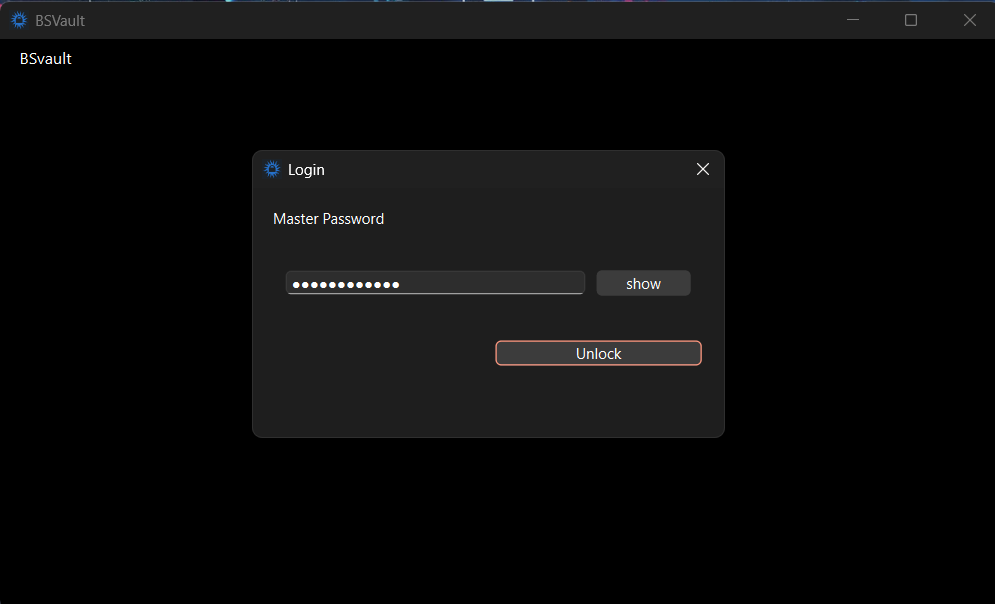
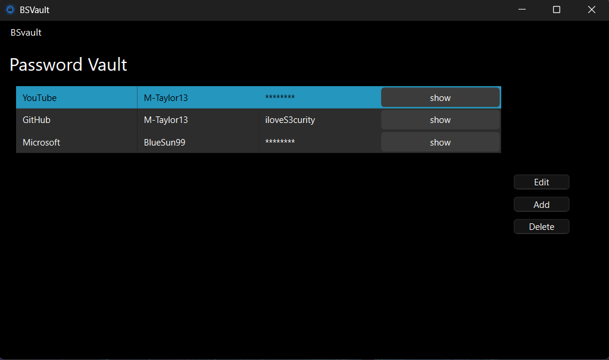
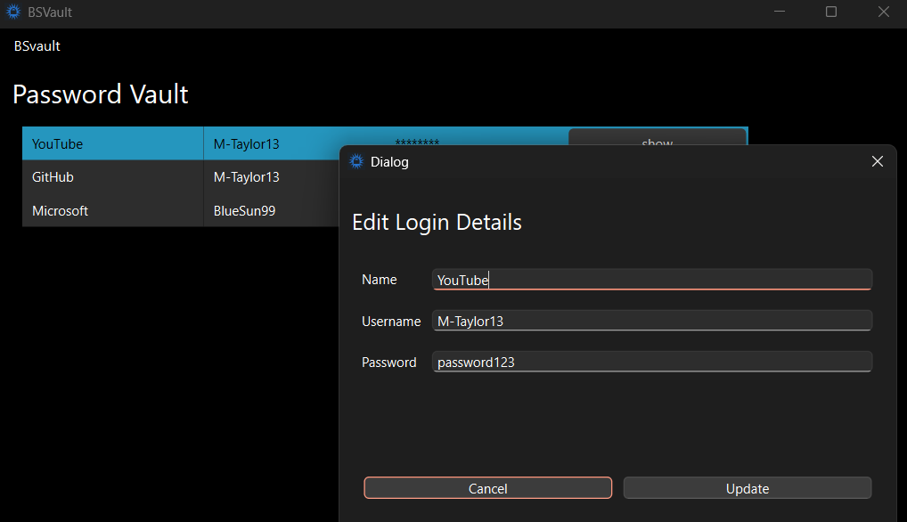

# BSVault by M-Taylor13
A lightweight C++ Qt 6 Windows Application for offline, local and secure password storage.

BSVault stores encrypted credentials locally on your system using strong cryptography.  
All data stays offline and is protected by your master password.

---

## Features

- **Offline storage** — no cloud, everything is local  
- **Strong encryption** using libsodium (PBKDF2, ChaCha20, etc.)  
- **Master password–protected vault**  
- **Encrypted entry storage (`store.bin`)**  
- **Secure password hashing (`master.hash`)**  
- **Qt 6 cross-platform UI**  
- Optional: delete vault data during uninstall  
- Installer built with Inno Setup  


## Security
- Master password is hashed using **PBKDF2** (Qt QPasswordDigestor) and **only stored temporarily in memory**
- Vault entries are encrypted using **ChaCha20-Poly1305** (libsodium), equivalent to AES256
- No data leaves the device
- No network connections
- No system access beyond creation and reading of storage files

---

## Installation (Windows)

1. Download the latest installer from the **Releases** page:  
   -> https://github.com/M-Taylor13/BSVault/releases

2. Run the installer (`BSVaultInstaller.exe`).

3. A desktop shortcut will be created automatically.

4. Launch the app and create your master password. **Do not forget it, or you will not be able to access your passwords.**
It is recomended to write the master password down somewhere safe.

---

## Vault Data Location

BSVault saves encrypted data in:

- %APPDATA%\BSVault\master.hash (salt)

- %APPDATA%\BSVault\store.bin (encrypted data)


These files do **not** exist until you first run the application.

During uninstall these will be deleted, meaning **your password data will be deleted as well.** Take note of important information before uninstalling

---

## Building From Source

### Requirements
- **Qt 6.7+** (or whichever you use)
- **CMake** or Qt Creator
- **A C++20 compiler**
- **libsodium** (install via vcpkg or include with local .a and include files)

### Build with Qt Creator
1. Open the project folder in Qt Creator  
2. Configure a **Release** build  
3. Build → Run

### Build from command line

```sh
cmake -S . -B build -DCMAKE_BUILD_TYPE=Release
cmake --build build --config Release
```
The binary will appear in build\Release\

### Deploying

Run to deploy on Windows:
```sh
windeployqt.exe build\Release\BSVault.exe
```
from here, Inno Setup can be used to create your own installer with a .iss file

### Screenshots






### Acknowledgements
- Qt Framework
- libsodium (cryptography)
- Inno Setup (Windows installer)
